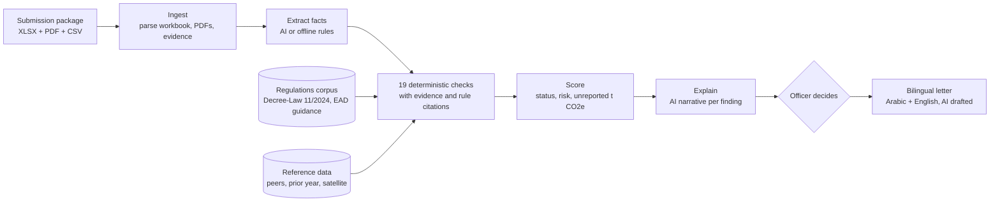

# ZeroCarbon.gov

**Companies report. AI checks. The regulator decides.**

ZeroCarbon.gov is an AI review copilot for UAE regulators. When an industrial facility submits its annual greenhouse gas
report, ZeroCarbon.gov reads the whole package (Excel report, PDFs and evidence files), checks it against the law and
the official guidance, recalculates the numbers, compares the facility with its peers and with satellite methane data,
and gives the officer a clear result: **compliant, needs clarification or non-compliant**, with a risk score, the
estimated unreported emissions, and a citation to the rule and the exact evidence behind every issue. The officer
decides, and ZeroCarbon.gov drafts the follow-up letter in **Arabic and English**.

```bash
git clone https://github.com/saimali7/ZeroCarbon.gov.git
cd ZeroCarbon.gov
npm start
```

That is the whole setup. Requires [Node.js](https://nodejs.org) 20.9 or newer. No API keys, no database, no `.env`
editing. The browser opens at **http://localhost:3000**. [More ways to run it](#run-it).

---

## Why this matters

| National goal | The problem behind it |
| --- | --- |
| The UAE's NDC 3.0 commits to cutting emissions **47% by 2035** (vs 2019) on the way to **Net Zero 2050**. | A national target is only as strong as the emissions data behind it. |
| **Federal Decree-Law No. 11 of 2024** requires designated entities to measure their emissions, keep an inventory, report periodically and keep records (Art. 6(1)). Courts can fine breaches **AED 50,000 to 2,000,000** (Art. 15), doubled for a repeat within two years of a final conviction (Art. 16). The law has been in force since 30 May 2025, with a one-year window to comply. | Every report is a complex package: an EAD MRV workbook, a monitoring plan, a verification statement, lab and calibration certificates, meter logs. Checking one properly takes a specialist days. |
| Abu Dhabi's **EAD facility MRV programme** covers power, oil and gas, industry and transport facilities above **25,000 t CO2e a year**, for CO2 and methane, with reports due **31 March**. | Methane leaks, undeclared data gaps and wrong factors hide in the detail. Third-party verification is voluntary until 2027, so the regulator is often the first real check. |

ZeroCarbon.gov does the first pass in **under a second per report**, so officers spend their time on judgement, not
arithmetic.

## What it finds: the demo

The repo ships two fictional submission packages from the same operator, built to look like real EAD submissions
(`demo/submissions`), plus simulated regulator reference data (peer benchmarks, last year's reports, satellite
methane detections).

| | Eastern Dunes CPF-1 | Southern Dunes CPF-2 |
| --- | --- | --- |
| Reported | 242,693 t CO2e | 274,896 t CO2e |
| Result | **Compliant**, risk 0 | **Non-compliant**, risk 88 |
| Estimated unreported | 0 | **54,179 t CO2e (19.7%)** |
| Corrected intensity | 12.63 kg CO2e/boe | 12.74 kg CO2e/boe (reported 10.65, peer median 13.4) |
| Recommended action | Approve | Query: corrected report within 30 days; consider a site inspection |

What the review finds in Southern Dunes CPF-2, each with evidence and a rule citation:

1. **Flare volumes contradict the company's own gas balance.** From June to December, reported flaring is 62.2% below the production gas balance: about **39,447 t CO2e** missing.
2. **Undeclared data gap.** The HP flare meter's calibration expired on 31 May 2025. From 1 June the flare log says "ENGINEERING ESTIMATE" for 214 days, yet the report declares no data gaps.
3. **Methane sources not quantified.** Tanks, the glycol vent, pneumatics, compressor seals and fugitives are marked "not applicable" or "de minimis", but the facility has them and its own monitoring plan says the method is "under development": about **11,648 t CO2e**.
4. **Declarations contradict the verifier.** The verification opinion is qualified and excludes those methane sources, but the report says "Verified" and "no data gaps".
5. **Wrong emission factor.** Fuel gas uses the IPCC default (56.1) while claiming a site-specific factor; the lab says 56.96: **3,084 t CO2**.
6. **Signals to investigate:** three satellite methane detections line up with a flare flame-out, a compressor trip and a "closed" tank farm; intensity is below every peer; emissions fell 9% while production rose 2.5%.

For Eastern Dunes, the one satellite detection is **explained** by a declared, quantified blowdown, so it is not
flagged. The expected results are documented in [`demo/ANSWER-KEY.md`](demo/ANSWER-KEY.md) and enforced by
automated tests.

## How it works



**Where AI is used, and where it is not.** Numbers, status and risk come from deterministic, tested checks, so the
same report always gets the same result and every figure can be traced. Generative AI (any model on
[OpenRouter](https://openrouter.ai)) does what it is good at:

| Step | AI does | Guardrails |
| --- | --- | --- |
| Read PDFs | Extracts facts from verification statements, calibration and lab certificates, monitoring plans, cover letters | Every fact needs a page and a verbatim quote; quotes are verified against the document text, otherwise the offline extractor's value is used |
| Explain | Writes the review summary and a plain-language explanation of each finding | Uses only numbers in the findings; can cite only rule ids that exist in the corpus |
| Ask | Answers officer questions about a submission | Citations must point at real documents in the package |
| Spot more | Suggests extra issues the rules did not cover | Shown separately, only when quotes are verified |
| Draft | Writes the Arabic and English letter for the officer's decision | Both languages must carry the same numbered points; the officer edits and approves |

**Without an API key** (the default, and what reviewers get), the same pipeline runs fully offline: rule-based
extraction and carefully written English and Arabic templates. Nothing in the demo needs the internet.

### The 19 checks

| Area | Checks |
| --- | --- |
| Completeness | Required identifiers, full period, CO2 and CH4, required sheets; submission deadline; reporting threshold |
| Calculation | Recalculate every source stream (activity x NCV x EF x oxidation), methane lines and totals (GWP 28); monthly vs annual activity |
| Evidence | Fuel meter log, flare log and diesel invoices vs reported activity; flare volumes vs the production gas balance |
| Data gaps | Estimated or substituted readings that were not declared; meter calibration valid for the whole period |
| Factors | Fuel and flare gas emission factors vs the lab certificate |
| Methane | Every methane source in scope quantified, with a peer-based estimate of what is missing |
| Context | Intensity and methane intensity vs peers; year-on-year trend vs production and mitigation |
| Satellite | Each detection classified as explained, corroborated by a logged event, or unexplained |
| Verification | Verifier opinion, scope exclusions and open findings vs the operator's declarations |

Every finding cites rules from a curated, sourced corpus of 20 provisions
([`apps/api/data/regulations.json`](apps/api/data/regulations.json)): Decree-Law 11/2024, Cabinet Resolution 67/2024,
EAD's Technical Guidance for MRV (Feb 2026) and IPCC defaults. Each has an English and Arabic summary and a link to
its source.

## Run it

| Command | What it does |
| --- | --- |
| `npm start` | Installs on first run, builds, starts the API and web app, opens the browser. Picks free ports if 3000/4000 are busy. |
| `npm run dev` | Same with hot reload. |
| `docker compose up --build` | For machines without Node.js. Then open http://localhost:3000. |
| `npm test` | Runs the API test suite (parsers, checks against the answer key, AI guardrails, routes). |
| `npm run typecheck` | Type-checks every workspace. |

Add `-- --no-open` to `npm start` to skip opening the browser.

### Live AI with OpenRouter (optional)

Add your key to `.env` (created on first run, gitignored) and restart:

```bash
OPENROUTER_API_KEY=sk-or-...
OPENROUTER_MODEL=google/gemini-3.8-flash   # any OpenRouter model with structured outputs
OPENROUTER_FALLBACK_MODELS=                # optional, comma-separated
AI_MODE=auto                               # auto | demo | live
```

The launcher prints which mode is active. If a live call fails, the pipeline falls back to the offline path, so a
review never breaks.

## API

The web app talks to the API through `/api/*` (proxied by Next.js). Routes are defined once in
[`packages/shared/src/routes.ts`](packages/shared/src/routes.ts) and all types in
[`packages/shared/src/index.ts`](packages/shared/src/index.ts).

| Method and path | Purpose |
| --- | --- |
| `GET /api/health` | Status, AI mode, model |
| `GET /api/submissions` | Officer inbox, highest risk first (`?status=`, `?stage=`, `?q=`) |
| `POST /api/submissions` | Upload a package (multipart `files` + optional `relativePaths`); `?review=true` reviews it immediately |
| `GET /api/submissions/:id` | Documents, parsed report, evidence, latest review, decisions, letters |
| `POST /api/submissions/:id/review` | Run the review pipeline |
| `POST /api/review-all` | Review every pending submission, with total time |
| `GET /api/submissions/:id/documents/:docId` (and `/text`) | Original file, or its extracted text per page |
| `POST /api/submissions/:id/ask` | Ask a question about the submission |
| `POST /api/submissions/:id/decisions` | Record a decision (approve, request clarification, escalate to inspection, refer for penalty) and draft the letter |
| `POST /api/submissions/:id/letters`, `PATCH /api/letters/:id` | Draft, edit and approve letters |
| `GET /api/dashboard`, `GET /api/map` | National overview; GeoJSON of facilities, peers and satellite plumes |
| `GET /api/reference`, `GET /api/regulations`, `GET /api/audit` | Reference data, rules corpus, audit trail |
| `POST /api/demo/reset` | Clear reviews, decisions and letters to rerun the demo |

## Project structure

```
apps/api            Node.js API (Express 5, TypeScript via tsx)
  src/ingest        XLSX reader, EAD workbook parser, PDF text, evidence CSVs
  src/extract       Facts from PDFs (AI with verified quotes, or offline rules)
  src/checks        The 19 deterministic checks
  src/review        Pipeline and risk scoring
  src/ai            OpenRouter client, narrative, bilingual letters, Q&A, offline templates
  src/regulations   Rules corpus lookup (data in apps/api/data/regulations.json)
  src/routes        REST API; src/store: JSON persistence in .data/
apps/web            Next.js 16 officer app (inbox, review, evidence viewer, letters, audit)
packages/shared     Types and route contract shared by API and web
demo/               Fictional submission packages, simulated reference data, answer key, generator
scripts/start.mjs   Zero-dependency one-command launcher
```

## Data and limitations

- **All companies, facilities, people and figures in `demo/` are fictional.** Satellite detections are simulated
  and labelled as such; in production they would come from public methane plume products. A detection is always
  presented as a signal to investigate, never as proof.
- The workbook follows the structure of EAD's MRV reporting template but is not the official file.
- Rule summaries are plain-language paraphrases for officers, not legal advice; each links to its source.
- ZeroCarbon.gov is designed as a review layer that plugs into existing government systems (the Ministry's national
  MRV system and EAD's facility portal), not a replacement for them. The officer always makes the decision.
