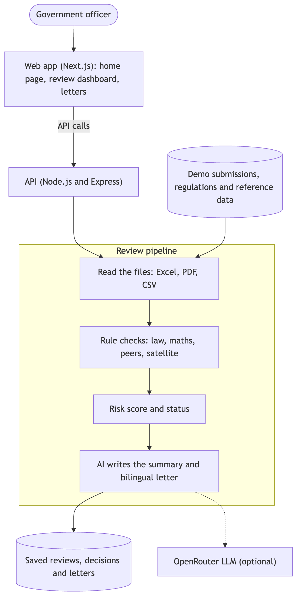

# Zerocarbon.gov

Zerocarbon.gov is an AI review copilot for UAE regulators. Companies submit their annual emissions reports under the UAE Climate Law (Federal Decree-Law No. 11 of 2024), the AI checks each one against the law, the company's own evidence, peer facilities and satellite methane data, and a government officer makes the final decision and sends a bilingual (English and Arabic) letter. To try it, install [Node.js](https://nodejs.org) 20.9 or newer and run `npm start` in the project folder. The app opens at http://localhost:3000, works offline and needs no API keys. Drop a folder from `demo/submissions/` into the chat box on the home page, or open one of the completed runs below it. All companies and figures are fictional.

## Architecture

The rule checks are deterministic: the AI explains and drafts, but never sets the status or risk score. Without an API key the app uses cached AI output and templates, so it runs fully offline. Diagram source: `docs/architecture.mmd`.
